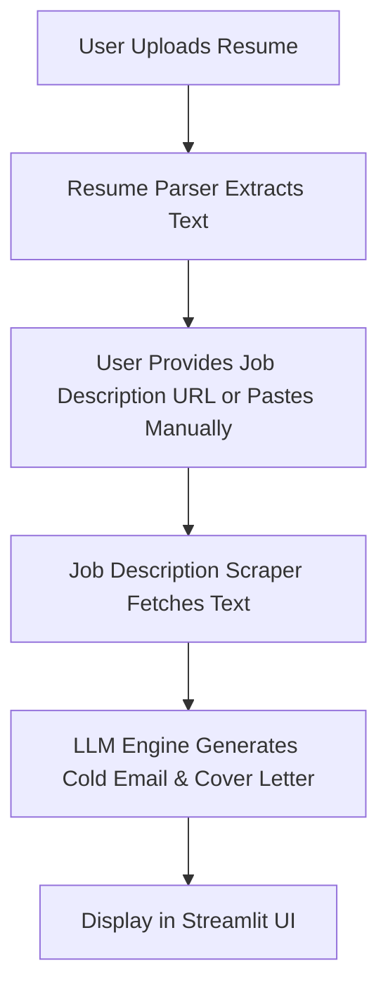

# 📧 Cold Email & Cover Letter Generator

This project is a **Streamlit-based web app** that allows users to:

* 📂 Upload their **resume** (PDF/DOCX)
* 📄 Provide a **job description** (via URL or manual paste)
* 🤖 Automatically generate a **cold email** and **cover letter** using an LLM
* 📤 Optionally send the email directly to a recruiter from the app

---

## 🚀 Features

* **Resume Parsing** – Extracts meaningful text from PDF/DOCX resumes
* **Job Description Scraping** – Fetches job descriptions from a URL
* **AI-Generated Content** – Uses a Large Language Model (LLM) to create personalized cold emails and cover letters
* **Email Sending** – Sends emails via SMTP (if enabled)
* **User-Friendly UI** – Built with Streamlit for easy interaction

---

## 📂 Project Structure

```
├── app.py              # Main Streamlit application  
├── email_sender.py     # Handles sending emails  
├── jd_scraper.py       # Scrapes job description from URL  
├── llm_engine.py       # Connects to LLM for content generation  
├── resume_parser.py    # Extracts text from resumes  
├── utils.py            # Helper functions  
├── requirements.txt    # Python dependencies  
├── .gitignore          # Ignored files  
└── .streamlit/         # Streamlit config files  
```

---

## ⚙️ Installation

### 1️⃣ Clone the Repository

```bash
git clone https://github.com/yourusername/your-repo-name.git
cd your-repo-name
```

### 2️⃣ Install Dependencies

```bash
pip install -r requirements.txt
```

### 3️⃣ Set Environment Variables

Create a `.env` file in the project root:

```env
EMAIL_ADDRESS=your-email@gmail.com
EMAIL_PASSWORD=your-app-password
GROQ_API_KEY=your-groq-api-key
```

---

## ▶ Usage

Run the Streamlit app:

```bash
streamlit run app.py
```

1. Upload your resume (PDF or DOCX)
2. Paste the job description URL (or paste manually if scraping fails)
3. Optionally add GitHub or portfolio links
4. Click **Generate Email & Cover Letter**
5. Review the generated content
6. If enabled, send directly to the recruiter

---

## 🔄 Workflow



---

## 📦 Dependencies

Main Python packages:

* **streamlit** → UI framework
* **PyPDF2 / docx2txt** → Resume parsing
* **requests / BeautifulSoup4** → Job description scraping
* **groq** → Connecting to Groq LLM models
* **smtplib** → Email sending
* **python-dotenv** → Environment variable management

Install them all with:

```bash
pip install -r requirements.txt
```

---

## 🤖 LLM Module (`llm_engine.py`)

**Responsibilities:**

* Receives resume text, job description, and optional GitHub/portfolio links
* Builds a prompt for the AI model
* Calls the LLM API (like **Groq LLaMA-3**)
* Returns:

  * **Cold Email** (short, recruiter-friendly)
  * **Cover Letter** (formal and detailed)

**Example Usage**:

```python
from llm_engine import generate_cold_email_and_cover

resume_text = "Experienced Python developer..."
job_description = "Looking for an AI Engineer..."
github_link = "https://github.com/example"
portfolio_link = "https://myportfolio.com"

email, cover_letter = generate_cold_email_and_cover(
    resume_text, job_description, github_link, portfolio_link
)

print(email)
print(cover_letter)
```


## 📜 License

This project is open-source under the **MIT License**.
You can freely use, modify, and distribute it, but **without warranty**.

---


